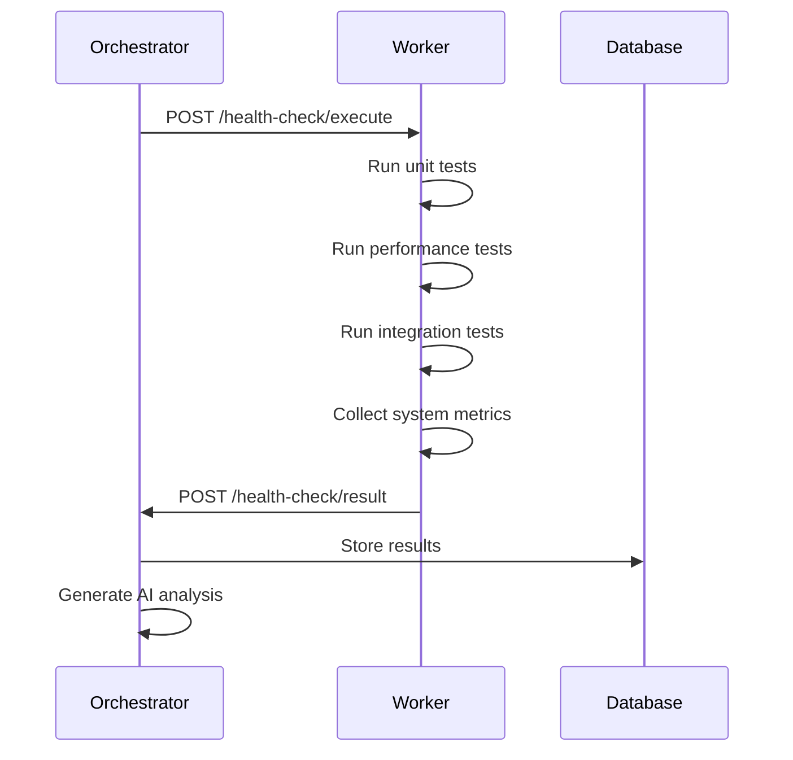

# Worker Health Check System

A comprehensive, AI-powered health monitoring and testing system for the core-vibe-hq ecosystem. The orchestrator coordinates health checks across all downstream workers, collects detailed results, and provides intelligent analysis and recommendations.

## 🎯 System Overview

### Architecture
```
┌─────────────────┐    ┌──────────────────────────────────────┐
│   Orchestrator  │    │           Downstream Workers         │
│                 │    │                                      │
│ HealthCheckOps  │◄──►│  HealthCheckHandler                 │
│                 │    │  WorkerHealthCheck                  │
│ - Initiate      │    │                                      │
│ - Coordinate    │    │  - Unit Tests                       │
│ - Collect  │    │  - Performance Tests                │
│ - Analyze (AI)  │    │  - Integration Tests                │
│ - Store Results │    │  - System Metrics                   │
└─────────────────┘    │  - Connectivity Tests               │
                       └──────────────────────────────────────┘
```

### Key Features
- 🤖 **AI-Powered Analysis** - Intelligent health assessment and recommendations
- 📊 **Comprehensive Testing** - Unit, performance, and integration tests
- 🔄 **Automated Scheduling** - Cron-based daily health checks
- 🎯 **On-Demand Execution** - Manual health checks via API
- 📈 **Historical Tracking** - Complete health check history and trends
- 🚨 **Real-time Monitoring** - Live status updates and notifications
- 🔗 **RPC Coordination** - Asynchronous worker communication

## 🗄️ Database Schema

**Database Location**: All health tables are consolidated in the `DB_HEALTH` D1 database under a unified Drizzle schema.

**Schema Consolidation**: As of Task 39 completion, all health-related tables (`health_checks`, `worker_health_checks`, `health_check_schedules`, `test_profiles`, `test_results`, `ai_logs`, `health_summaries`) are now defined in a single Drizzle schema file (`orchestrator/worker/database/schema.ts`) instead of being split across multiple files. This provides better type safety and consistency.

### Main Tables

#### `health_checks` - Health Check Instances
```sql
CREATE TABLE health_checks (
    id INTEGER PRIMARY KEY AUTOINCREMENT,
    health_check_uuid TEXT UNIQUE NOT NULL,
    trigger_type TEXT NOT NULL, -- 'cron' or 'on_demand'
    trigger_source TEXT, -- user_id for on_demand, 'system' for cron
    status TEXT DEFAULT 'running', -- 'running', 'completed', 'failed', 'timeout'
    total_workers INTEGER DEFAULT 0,
    completed_workers INTEGER DEFAULT 0,
    passed_workers INTEGER DEFAULT 0,
    failed_workers INTEGER DEFAULT 0,
    overall_health_score REAL DEFAULT 0.0, -- 0.0 to 1.0
    ai_analysis TEXT, -- AI-generated analysis
    ai_recommendations TEXT, -- AI-generated recommendations
    started_at DATETIME DEFAULT CURRENT_TIMESTAMP,
    completed_at DATETIME,
    timeout_at DATETIME,
    created_at DATETIME DEFAULT CURRENT_TIMESTAMP
);
```

#### `worker_health_checks` - Individual Worker Results
```sql
CREATE TABLE worker_health_checks (
    id INTEGER PRIMARY KEY AUTOINCREMENT,
    worker_check_uuid TEXT UNIQUE NOT NULL,
    health_check_uuid TEXT NOT NULL,
    worker_name TEXT NOT NULL,
    worker_type TEXT NOT NULL,
    status TEXT DEFAULT 'pending', -- 'pending', 'running', 'completed', 'failed'
    overall_status TEXT, -- 'healthy', 'degraded', 'unhealthy', 'critical'
    health_score REAL DEFAULT 0.0,
    
    -- System metrics
    uptime_seconds INTEGER,
    memory_usage_mb REAL,
    cpu_usage_percent REAL,
    response_time_ms INTEGER,
    
    -- Connectivity tests
    orchestrator_connectivity BOOLEAN DEFAULT FALSE,
    external_api_connectivity BOOLEAN DEFAULT FALSE,
    database_connectivity BOOLEAN DEFAULT FALSE,
    
    -- Test results
    unit_tests_total INTEGER DEFAULT 0,
    unit_tests_passed INTEGER DEFAULT 0,
    unit_tests_failed INTEGER DEFAULT 0,
    unit_test_results TEXT, -- JSON array
    
    performance_tests_total INTEGER DEFAULT 0,
    performance_tests_passed INTEGER DEFAULT 0,
    performance_tests_failed INTEGER DEFAULT 0,
    performance_test_results TEXT, -- JSON array
    
    integration_tests_total INTEGER DEFAULT 0,
    integration_tests_passed INTEGER DEFAULT 0,
    integration_tests_failed INTEGER DEFAULT 0,
    integration_test_results TEXT, -- JSON array
    
    -- Analysis and errors
    error_message TEXT,
    warnings TEXT, -- JSON array
    raw_results TEXT, -- Full JSON payload
    ai_worker_analysis TEXT,
    ai_worker_recommendations TEXT,
    
    -- Timestamps
    requested_at DATETIME DEFAULT CURRENT_TIMESTAMP,
    started_at DATETIME,
    completed_at DATETIME,
    
    FOREIGN KEY (health_check_uuid) REFERENCES health_checks(health_check_uuid)
);
```

#### `health_check_schedules` - Cron Configuration
```sql
CREATE TABLE health_check_schedules (
    id INTEGER PRIMARY KEY AUTOINCREMENT,
    name TEXT UNIQUE NOT NULL,
    cron_expression TEXT NOT NULL, -- e.g., '0 2 * * *' for daily at 2 AM
    enabled BOOLEAN DEFAULT TRUE,
    timeout_minutes INTEGER DEFAULT 30,
    include_unit_tests BOOLEAN DEFAULT TRUE,
    include_performance_tests BOOLEAN DEFAULT TRUE,
    include_integration_tests BOOLEAN DEFAULT TRUE,
    worker_filters TEXT, -- JSON array of worker names/types
    created_at DATETIME DEFAULT CURRENT_TIMESTAMP,
    updated_at DATETIME DEFAULT CURRENT_TIMESTAMP
);
```

## 🚀 API Reference

### Orchestrator HealthCheckOps Entrypoint

#### `initiateHealthCheck(params)`
Initiate a new health check across all or specified workers.

```typescript
const result = await env.ORCHESTRATOR_HEALTH_CHECK.initiateHealthCheck({
  trigger_type: 'on_demand',
  trigger_source: 'user_123',
  timeout_minutes: 45,
  include_unit_tests: true,
  include_performance_tests: true,
  include_integration_tests: true,
  worker_filters: ['agent-factory', 'data-factory'] // Optional
})

// Returns: { health_check_uuid, status, total_workers, message }
```

#### `getHealthCheckStatus(uuid)`
Get current status and results of a health check.

```typescript
const status = await env.ORCHESTRATOR_HEALTH_CHECK.getHealthCheckStatus(
  'health-check-uuid-here'
)

// Returns: HealthCheckStatusResponse with worker results
```

### HTTP API Endpoints

The orchestrator now exposes REST endpoints so operators and dashboards can invoke and observe health checks without using the Workers RPC directly.

#### `POST /api/health/checks`
- **Description**: Trigger a new distributed health check run.
- **Body** *(JSON)*:
  - `trigger_type`: `'on_demand' | 'cron'` (default `'on_demand'`)
  - `worker_filters`: optional string array of worker names/types to target
  - `include_unit_tests`, `include_performance_tests`, `include_integration_tests`: optional booleans
  - `timeout_minutes`: optional number override
- **Response**: `{ ok: true, result: HealthCheckResponse }`

#### `GET /api/health`
- **Description**: Returns the latest health check summary plus overall statistics.
- **Response**: `{ ok: true, summary: {...}, latest: HealthCheckStatusResponse | null }`

#### `GET /api/health/checks`
- **Description**: Paginated list of historical health checks.
- **Query params**: `page`, `limit`, `triggerType`.
- **Response**: `{ ok: true, history: HealthCheckHistoryResponse }`

#### `GET /api/health/checks/:uuid`
- **Description**: Detailed results for a specific health check run.

#### `GET /api/health/workers`
- **Description**: Returns the configured worker targets (service bindings or URLs) that will participate in health checks.

#### `GET /api/health/workers/:workerName/latest`
- **Description**: Fetch the most recent result recorded for a specific worker.

### Worker RPC Endpoints

Both the orchestrator and the base worker expose a common set of RPC endpoints that the health system uses to coordinate checks:

| Method & Path              | Purpose                                | Notes |
|---------------------------|----------------------------------------|-------|
| `POST /health-check/execute` | Orchestrator request to start a worker health check | Body contains `worker_check_uuid`, options, and orchestrator callback URL. |
| `GET /health-check/status`  | Lightweight status probe               | Returns cached status without executing full tests. |
| `GET /health-check/quick`   | Minimal connectivity / latency probe   | Used for rapid availability checks. |
| `POST /health-check/result` *(orchestrator only)* | Worker callback delivering health check results | Automatically stores results in `DB_HEALTH`. |

> **Security:** These endpoints bypass CSRF middleware and are intended for service-to-service communication. Use the internal Cloudflare network or add a pre-shared token if exposing publicly.

### Base Worker Observability

The base worker also exposes `GET /api/health` and `GET /api/health/history`, backed by the `HealthCheckActor`, which provides real-time status and a rolling history of the proactive checks it runs every two minutes. These endpoints are public (read-only) so Mission Control dashboards can surface live readiness indicators.

#### `getHealthCheckHistory(page, limit, triggerType?)`
Get paginated health check history.

```typescript
const history = await env.ORCHESTRATOR_HEALTH_CHECK.getHealthCheckHistory(
  1, 20, 'on_demand'
)

// Returns: { health_checks, total_count, page, limit }
```

#### `receiveHealthCheckResult(workerCheckUuid, results)`
Receive results from a worker (called by workers).

```typescript
const response = await env.ORCHESTRATOR_HEALTH_CHECK.receiveHealthCheckResult(
  'worker-check-uuid',
  healthCheckResults
)

// Returns: { success: boolean, message: string }
```

### Worker Health Check Endpoints

#### `POST /health-check/execute`
Execute comprehensive health check (called by orchestrator).

```json
{
  "worker_check_uuid": "uuid-here",
  "options": {
    "include_unit_tests": true,
    "include_performance_tests": true,
    "include_integration_tests": true
  },
  "callback_url": "http://orchestrator/health-check/result"
}
```

#### `GET /health-check/status`
Get basic worker health status.

```json
{
  "worker_name": "agent-factory",
  "worker_type": "agent-factory",
  "status": "healthy",
  "timestamp": "2025-11-04T10:30:00Z",
  "uptime_seconds": 86400,
  "orchestrator_available": true
}
```

#### `GET /health-check/quick`
Get quick health check (lightweight).

```json
{
  "worker_name": "agent-factory",
  "worker_type": "agent-factory", 
  "status": "healthy",
  "response_time_ms": 45,
  "orchestrator_connectivity": true,
  "timestamp": "2025-11-04T10:30:00Z"
}
```

## 🔧 Implementation Guide

### 1. Orchestrator Setup

Add the HealthCheckOps entrypoint to your orchestrator:

```typescript
// In orchestrator worker index.ts
import { HealthCheckOps } from './entrypoints/healthCheckOps'

export default {
  async fetch(request: Request, env: CoreEnv): Promise<Response> {
    // Handle health check routes
    if (url.pathname.startsWith('/health-check')) {
      const healthCheckOps = new HealthCheckOps(env)
      return await handleHealthCheckRoutes(request, healthCheckOps)
    }
    
    // Other routes...
  }
}

// Export entrypoints
export { HealthCheckOps }
```

### 2. Worker Integration

Integrate health checks into downstream workers:

```typescript
import { HealthCheckHandler } from '@shared/handlers/healthCheckHandler'
import { DiagnosticsHandler } from '@shared/handlers/diagnosticsHandler'

interface WorkerEnv extends WorkerHealthCheckEnv, DiagnosticsEnv {
  // Your worker-specific environment
}

export default {
  async fetch(request: Request, env: WorkerEnv): Promise<Response> {
    const url = new URL(request.url)
    
    // Health check routes
    if (url.pathname.startsWith('/health-check')) {
      const healthCheck = new HealthCheckHandler(env)
      return await healthCheck.handleRequest(request)
    }
    
    // Diagnostics routes
    if (url.pathname.startsWith('/diagnostics')) {
      const diagnostics = new DiagnosticsHandler()
      return await diagnostics.handleRequest(request, env)
    }
    
    // Your worker logic...
  }
}
```

### 3. Custom Worker Tests

Extend the health check system with worker-specific tests:

```typescript
import { WorkerHealthCheck, TestResult } from '@shared/health/workerHealthCheck'

class CustomWorkerHealthCheck extends WorkerHealthCheck {
  protected async runWorkerSpecificUnitTests(): Promise<TestResult[]> {
    const tests: TestResult[] = []
    
    // Add your custom unit tests
    tests.push(await this.runTest('Custom Feature Test', async () => {
      // Your test logic here
      const result = await testCustomFeature()
      if (!result.success) {
        throw new Error('Custom feature test failed')
      }
      return result
    }))
    
    return tests
  }
  
  protected async runWorkerSpecificPerformanceTests(): Promise<TestResult[]> {
    // Add performance tests specific to your worker
    return []
  }
  
  protected async runWorkerSpecificIntegrationTests(): Promise<TestResult[]> {
    // Add integration tests specific to your worker
    return []
  }
}
```

## 📊 Health Check Flow

### 1. Initiation (Orchestrator)
```typescript
// On-demand health check
const healthCheck = await orchestrator.initiateHealthCheck({
  trigger_type: 'on_demand',
  trigger_source: 'admin_user',
  timeout_minutes: 30
})

console.log(`Health check started: ${healthCheck.health_check_uuid}`)
```

### 2. Worker Execution


### 3. Result Collection
```typescript
// Check status
const status = await orchestrator.getHealthCheckStatus(healthCheckUuid)

console.log(`Progress: ${status.completed_workers}/${status.total_workers}`)
console.log(`Health Score: ${status.overall_health_score}`)

if (status.status === 'completed') {
  console.log('AI Analysis:', status.ai_analysis)
  console.log('Recommendations:', status.ai_recommendations)
}
```

## 🤖 AI Analysis

The system uses Cloudflare AI to analyze health check results:

### Individual Worker Analysis
- **Health Score Interpretation** - Explains what the score means
- **Performance Assessment** - Identifies bottlenecks and issues
- **Test Failure Analysis** - Explains why tests failed and how to fix
- **Connectivity Issues** - Diagnoses network and service problems

### System-Wide Analysis
- **Overall Ecosystem Health** - Holistic view of all workers
- **Trend Analysis** - Identifies patterns and degradation
- **Priority Recommendations** - Actionable steps ranked by importance
- **Capacity Planning** - Suggests scaling and optimization

### Example AI Output
```
Analysis: The agent-factory worker shows degraded performance with a health 
score of 0.72. Unit tests are passing (15/15), but performance tests indicate 
response times have increased by 40% compared to baseline. Integration tests 
show intermittent failures with the external AI service.

Recommendations:
1. Investigate memory usage - current allocation patterns suggest a potential leak
2. Review AI service timeout configuration - increase from 5s to 10s
3. Consider implementing request queuing to handle concurrent load better
4. Monitor external API rate limits - may be hitting throttling
```

## 📈 Monitoring and Alerting

### Health Score Thresholds
- **🟢 Healthy (0.9-1.0)** - All systems operating normally
- **🟡 Degraded (0.7-0.89)** - Minor issues, monitoring recommended  
- **🟠 Unhealthy (0.4-0.69)** - Significant issues, intervention needed
- **🔴 Critical (0.0-0.39)** - Severe problems, immediate action required

### Automated Scheduling
```sql
-- Default daily health check at 2 AM
INSERT INTO health_check_schedules (name, cron_expression, timeout_minutes) 
VALUES ('daily_health_check', '0 2 * * *', 45);

-- Weekly comprehensive check on Sundays
INSERT INTO health_check_schedules (name, cron_expression, timeout_minutes) 
VALUES ('weekly_comprehensive', '0 1 * * 0', 90);
```

### WebSocket Integration
```javascript
// Real-time health check monitoring
const client = new WorkerWebSocketClient('ws://orchestrator/ws')

client.subscribe('health_check_update', (update) => {
  console.log(`Health check ${update.uuid}: ${update.status}`)
  updateDashboard(update)
})

client.subscribe('health_check_completed', (result) => {
  console.log(`Health check completed with score: ${result.overall_health_score}`)
  showNotification(result)
})
```

## 🔍 Troubleshooting

### Common Issues

**Health Check Timeout**
```
Error: Health check timed out after 30 minutes
Solution: Increase timeout_minutes or investigate slow workers
```

**Worker Not Responding**
```
Error: Worker agent-factory not responding to health check
Solution: Check worker status, restart if necessary, verify RPC bindings
```

**AI Analysis Failed**
```
Error: AI analysis unavailable
Solution: Check AI service binding, verify model availability
```

**Database Connection Issues**
```
Error: Failed to store health check results
Solution: Verify D1 database binding, check orchestrator connectivity
```

### Debug Mode
```typescript
// Enable verbose health check logging
const healthCheck = await orchestrator.initiateHealthCheck({
  trigger_type: 'on_demand',
  debug_mode: true, // Add this for detailed logging
  timeout_minutes: 60
})
```

## 🚀 Future Enhancements

### Planned Features
- **Custom Test Suites** - Worker-specific test configurations
- **Performance Baselines** - Historical performance comparison
- **Predictive Analysis** - AI-powered failure prediction
- **Auto-Remediation** - Automatic issue resolution
- **Multi-Region Support** - Cross-region health monitoring
- **Integration Webhooks** - External system notifications
- **Custom Dashboards** - Personalized health monitoring views

### API Extensions
- **Streaming Results** - Real-time result streaming via WebSocket
- **Batch Operations** - Multiple health checks in parallel
- **Custom Metrics** - Worker-defined health metrics
- **Threshold Alerts** - Configurable alerting rules

## 📄 Configuration Examples

### Cron Schedule Configuration
```json
{
  "name": "business_hours_check",
  "cron_expression": "0 */4 9-17 * * 1-5",
  "enabled": true,
  "timeout_minutes": 20,
  "include_unit_tests": true,
  "include_performance_tests": false,
  "include_integration_tests": true,
  "worker_filters": ["agent-factory", "ui-factory"]
}
```

### Worker-Specific Health Check
```typescript
// Health check specific workers
const result = await env.ORCHESTRATOR_HEALTH_CHECK.initiateHealthCheck({
  trigger_type: 'on_demand',
  worker_filters: ['data-factory'],
  include_unit_tests: true,
  include_performance_tests: true,
  include_integration_tests: false,
  timeout_minutes: 15
})
```

This comprehensive health check system ensures the reliability and performance of your entire worker ecosystem with intelligent monitoring, detailed analysis, and proactive recommendations! 🎯✨
