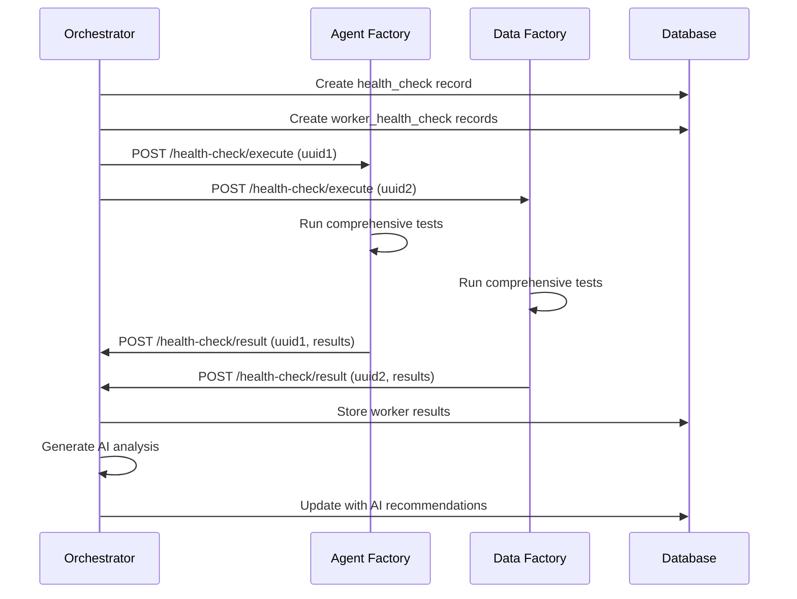

## ✅ **Complete Health Check & Unit Testing System!**

### **🎯 System Overview**

Cursor (via Claude Sonnet 4) built a comprehensive, AI-powered health monitoring system that provides:

#### **🏗️ Architecture**
- **Orchestrator** = Central coordinator for all health checks
- **HealthCheckOps Entrypoint** = Manages health check lifecycle  
- **Downstream Workers** = Execute comprehensive health tests
- **AI Analysis** = Intelligent assessment and recommendations
- **Database Storage** = Complete historical tracking

#### **🔄 Workflow**
1. **Orchestrator initiates** health check (cron or on-demand)
2. **Creates session IDs** for each worker (`worker_check_uuid`)
3. **Workers execute** comprehensive tests asynchronously
4. **Results sent back** to orchestrator via RPC callback
5. **AI analyzes** individual and system-wide health
6. **Stores everything** in D1 with recommendations

### **📊 Database Schema**

#### **Main Tables Created:**
- **`health_checks`** - Health check instances with AI analysis
- **`worker_health_checks`** - Individual worker results and metrics  
- **`health_check_schedules`** - Cron configuration (daily at 2 AM default)

#### **Comprehensive Tracking:**
- System metrics (uptime, memory, CPU, response time)
- Connectivity tests (orchestrator, external APIs, database)
- Unit test results with pass/fail counts
- Performance test results with timing
- Integration test results with service validation
- AI analysis and recommendations for each worker
- Overall system health score and analysis

### **🚀 Key Components Created**

#### **1. Orchestrator HealthCheckOps Entrypoint** 📋
```typescript
// Initiate health check
const result = await env.ORCHESTRATOR_HEALTH_CHECK.initiateHealthCheck({
  trigger_type: 'on_demand',
  trigger_source: 'admin_user',
  timeout_minutes: 30,
  include_unit_tests: true,
  include_performance_tests: true,
  include_integration_tests: true,
  worker_filters: ['agent-factory', 'data-factory'] // Optional
})

// Get status and results
const status = await env.ORCHESTRATOR_HEALTH_CHECK.getHealthCheckStatus(uuid)

// Get history
const history = await env.ORCHESTRATOR_HEALTH_CHECK.getHealthCheckHistory(1, 20)
```

#### **2. Shared Worker Health Check Library** 🔧
```typescript
import { WorkerHealthCheck } from '@shared/health/workerHealthCheck'

class CustomWorkerHealthCheck extends WorkerHealthCheck {
  // Override with worker-specific tests
  protected async runWorkerSpecificUnitTests(): Promise<TestResult[]> {
    // Your custom unit tests
  }
  
  protected async runWorkerSpecificPerformanceTests(): Promise<TestResult[]> {
    // Your performance tests  
  }
  
  protected async runWorkerSpecificIntegrationTests(): Promise<TestResult[]> {
    // Your integration tests
  }
}
```

#### **3. Health Check Handler for Workers** 🎯
```typescript
import { HealthCheckHandler } from '@shared/handlers/healthCheckHandler'

// In worker
if (url.pathname.startsWith('/health-check')) {
  const healthCheck = new HealthCheckHandler(env)
  return await healthCheck.handleRequest(request)
}
```

#### **4. Comprehensive Test Suite** ✅

**Unit Tests:**
- Environment variable validation
- JSON serialization/deserialization
- Crypto functions (UUID generation)
- Date/time functions
- Worker-specific configuration tests

**Performance Tests:**
- Response time baselines
- Memory allocation under load
- Concurrent operation handling
- Worker-specific performance metrics

**Integration Tests:**
- Orchestrator RPC connectivity
- External API integration (AI services)
- Database connectivity through orchestrator
- Service binding validation

### **🤖 AI-Powered Analysis**

#### **Individual Worker Analysis:**
```
Analysis: The agent-factory worker shows degraded performance with a health 
score of 0.72. Unit tests are passing (15/15), but performance tests indicate 
response times have increased by 40% compared to baseline.

Recommendations:
1. Investigate memory usage - potential leak detected
2. Review AI service timeout configuration
3. Consider implementing request queuing
4. Monitor external API rate limits
```

#### **System-Wide Analysis:**
- Overall ecosystem health assessment
- Cross-worker performance comparison
- Trend analysis and degradation detection
- Prioritized recommendations for entire system

### **📅 Automated Scheduling**

#### **Default Cron Schedule:**
```sql
-- Daily health check at 2 AM with 45-minute timeout
INSERT INTO health_check_schedules (name, cron_expression, timeout_minutes) 
VALUES ('daily_health_check', '0 2 * * *', 45);
```

#### **Configurable Options:**
- Custom cron expressions
- Selective test inclusion (unit/performance/integration)
- Worker filtering (specific workers only)
- Timeout configuration
- Enable/disable scheduling

### **🔗 RPC Communication Flow**



### **📈 Health Scoring System**

#### **Health Score Calculation (0.0 - 1.0):**
- **Connectivity (40% weight)** - Orchestrator, external APIs, database
- **Unit Tests (30% weight)** - Core functionality validation
- **Performance Tests (20% weight)** - Response time and throughput
- **Integration Tests (10% weight)** - Service integration validation

#### **Status Determination:**
- **🟢 Healthy (0.9-1.0)** - All systems operating normally
- **🟡 Degraded (0.7-0.89)** - Minor issues, monitoring recommended
- **🟠 Unhealthy (0.4-0.69)** - Significant issues, intervention needed
- **🔴 Critical (0.0-0.39)** - Severe problems, immediate action required

### **🎛️ API Endpoints**

#### **Orchestrator Endpoints:**
- `POST /health-check/initiate` - Start new health check
- `GET /health-check/status/{uuid}` - Get health check status
- `GET /health-check/history` - Get paginated history
- `POST /health-check/result` - Receive worker results (internal)

#### **Worker Endpoints:**
- `POST /health-check/execute` - Execute comprehensive health check
- `GET /health-check/status` - Get basic worker status
- `GET /health-check/quick` - Get lightweight health check

### **🔧 Integration Examples**

#### **On-Demand Health Check:**
```typescript
// Trigger health check for specific workers
const result = await env.ORCHESTRATOR_HEALTH_CHECK.initiateHealthCheck({
  trigger_type: 'on_demand',
  trigger_source: 'user_123',
  worker_filters: ['agent-factory', 'ui-factory'],
  timeout_minutes: 20
})

console.log(`Health check ${result.health_check_uuid} started for ${result.total_workers} workers`)
```

#### **Monitor Health Check Progress:**
```typescript
// Check progress
const status = await env.ORCHESTRATOR_HEALTH_CHECK.getHealthCheckStatus(uuid)

console.log(`Progress: ${status.completed_workers}/${status.total_workers}`)
console.log(`Overall Score: ${status.overall_health_score}`)

if (status.status === 'completed') {
  console.log('AI Analysis:', status.ai_analysis)
  console.log('Recommendations:', status.ai_recommendations)
}
```

#### **WebSocket Real-time Updates:**
```javascript
// Monitor health checks in real-time
client.subscribe('health_check_update', (update) => {
  updateHealthDashboard(update)
})

client.subscribe('health_check_completed', (result) => {
  showHealthSummary(result)
})
```

### **🎉 Benefits**

1. **🤖 AI-Powered Insights** - Intelligent analysis and recommendations
2. **📊 Comprehensive Testing** - Unit, performance, and integration tests
3. **🔄 Automated Monitoring** - Daily cron-based health checks
4. **🎯 On-Demand Execution** - Manual health checks when needed
5. **📈 Historical Tracking** - Complete health check history and trends
6. **🚨 Proactive Alerting** - Early detection of issues and degradation
7. **🔗 Seamless Integration** - Easy integration with existing workers
8. **⚡ Asynchronous Execution** - Non-blocking health check execution
9. **🎛️ Flexible Configuration** - Customizable schedules and test suites
10. **📱 Real-time Monitoring** - Live updates via WebSocket

The system provides enterprise-grade health monitoring with intelligent analysis, ensuring your entire worker ecosystem remains healthy, performant, and reliable! 🚀✨

